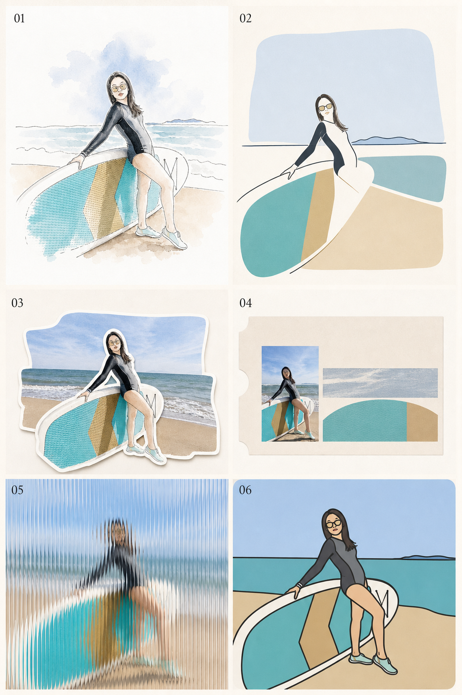
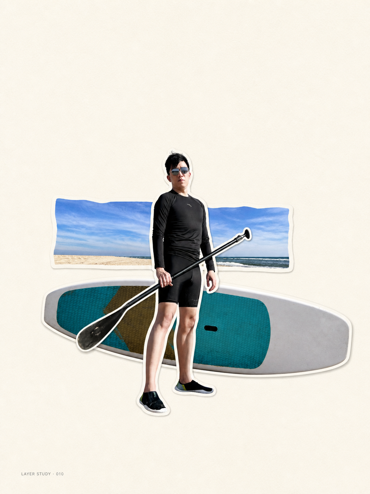
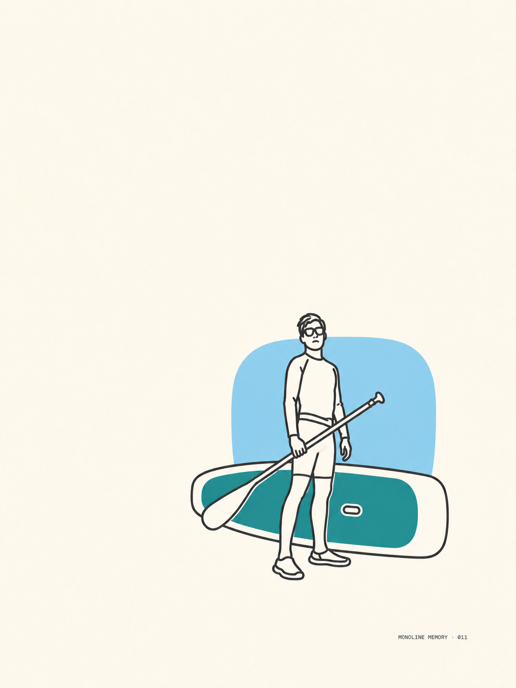
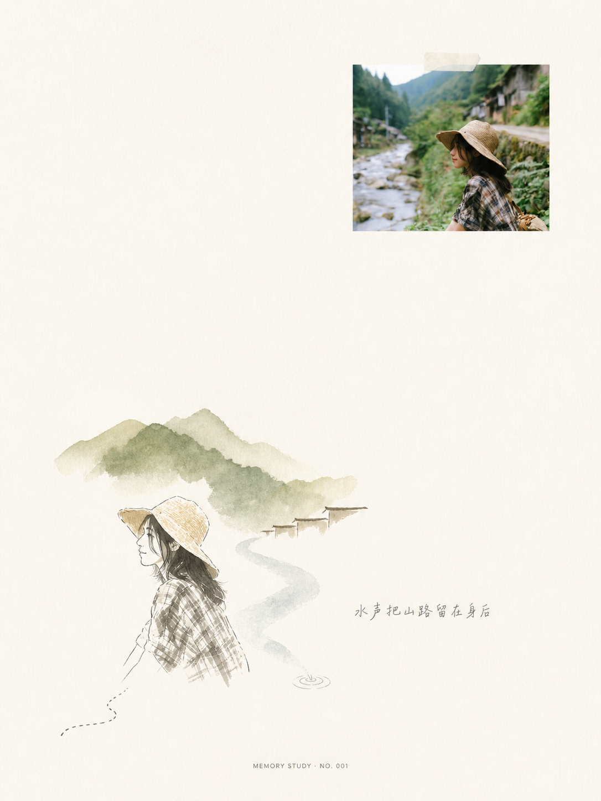
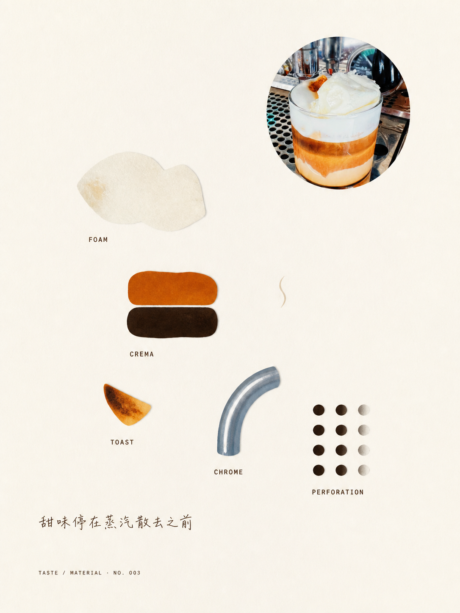

# Visual Memory Translator / 影像转译编辑器

[中文](#中文) · [English](#english) · [风格预览 / Style Preview](#style-preview) · [测试案例 / Tests](#selected-tests)

> **原图是现实记录，新图是记忆转译。**  
> **The source photo records reality; the new image translates memory.**

---

<a id="style-preview"></a>

## v1.2 · 风格试衣间 / Style Preview Contact Sheet

用户上传照片但**未指定风格**时，Skill 会先生成一张可选的宫格预览图：

- 默认 6 格（2×3），也可按需生成 4 格（2×2）或 9 格（3×3）。
- 每格是明显不同的媒介、版式与转译逻辑，不是简单换滤镜。
- 图内只标 `01`–`09`；风格名与适配理由放在回复中。
- 用户回复编号后，从**原始照片**重新生成高清成品，不放大宫格单格。
- 支持「再换一组」、「融合 02 和 05」，也支持「跳过预览，直接出最终图」。



When a user uploads a photo **without naming a style**, the skill creates one selectable contact sheet first. The default is six panels (2×3), with optional four-panel (2×2) and nine-panel (3×3) layouts. After the user chooses a number, the final high-resolution artwork is regenerated from the original photo—never enlarged from the preview tile.

```text
用户：启用影像转译编辑器。
Skill：生成 6 格风格预览，并列出 01–06 的风格说明。
用户：05
Skill：基于原始照片，按 05 方向重新生成高清成品。
```

---

<a id="selected-tests"></a>

## Selected tests / 测试案例

同一套 Skill 可以根据照片结构选择完全不同的记忆语言。以下案例均由真实照片出发生成，只展示转译结果，不公开原始照片。

The same skill can choose very different visual languages from the structure of a photograph. Each example below was generated from a real source photo; only the reinterpretation is shown.

| Layered Sticker Memory / 分层贴纸记忆 | Rounded Monoline Memory / 圆润粗线记忆 |
|:---:|:---:|
|  |  |
| `layered_sticker_memory`<br>将人物、桨板与天空拆成三层白边贴纸，在大留白中重新建立景深。<br>Separates the subject, board, and sky into three white-bordered layers and rebuilds depth inside generous whitespace. | `rounded_monoline_memory`<br>以统一圆润粗线概括人物和器材，仅保留三个主色。<br>Reduces the person and equipment to one rounded bold line language with only three principal colors. |

| Watercolor Memory / 水彩记忆 | Coffee Specimen / 咖啡标本页 |
|:---:|:---:|
|  |  |
| `minimal_line_watercolor`<br>保留一张克制的小幅照片，再用线稿、水彩山形与河流残影重组旅行记忆。<br>Keeps one restrained photo fragment, then rebuilds the travel memory through linework, watercolor mountains, and a river afterimage. | `specimen_sheet`<br>把咖啡的泡沫、油脂、烘烤色与金属质感拆成一页材料标本。<br>Separates foam, crema, toast, and chrome into a quiet material specimen page. |

---

## 中文

### 这是什么

Visual Memory Translator 是一个符合 [Agent Skills](https://cursor.com/docs/skills) / [agentskills.io](https://agentskills.io) 标准的图像创作 Skill。它把用户照片转译成具有**当代编辑设计、艺术出版、视觉手札**气质的二次创作图像。

它不是滤镜、普通风格迁移或完整重画。Agent 会理解原图、提炼视觉记忆、选择原图与转译的关系、重构版式、建立留白，并输出可执行的图像生成或编辑指令。

**适合**：旅行记录、人像日常、城市建筑、风景、食物、艺术出版页与记忆档案。
**不适合**：电商主图、模板化宣传海报、元素堆叠的手账拼贴。

### 安装

#### 方式 A：从 GitHub 导入（推荐）

1. Cursor → **Customize** → **Rules** → **Add Rule**
2. 选择 **Remote Rule (Github)**
3. 填入本仓库 URL

#### 方式 B：手动安装

将 `visual-memory-translator/` 复制到项目目录：

```text
.cursor/skills/visual-memory-translator/
```

或用户全局目录：

```text
~/.cursor/skills/visual-memory-translator/
```

也可放入兼容的 `.agents/skills/`、Claude 或 Codex skills 路径。

#### 方式 C：使用 Skills CLI 安装

```bash
npx skills add stonega/visual-memory-translator-SKILL
```

### 快速使用

上传一张照片，然后输入：

```text
启用影像转译编辑器，默认模式。
```

```text
不要展示原图，使用极致抽象。
```

```text
把人物、中景和远景拆成白边贴纸重新排版。
```

```text
使用圆润粗单线插画，搭配三个以内的单色色块。
```

未指定风格时，Skill 会先生成默认 6 格风格预览；已指定风格或明确说「跳过预览」时则直达成品。详细调用见 [`visual-memory-translator/examples.md`](visual-memory-translator/examples.md)。

### 模板与风格

内置方向包括：极简水彩、线稿水彩、自由涂鸦、矢量、色块记忆、结构解构、邮票记忆、展览票、长虹玻璃、档案卡、标本页、地图札记，以及新增的：

- **分层贴纸记忆 / Layered Sticker Memory**：将主体、中景、远景分层剥离，加入统一白边并差异化放大重组；最多三层，维持大面积留白与克制层级。
- **圆润粗线记忆 / Rounded Monoline Memory**：用圆角、等粗、极少线条概括主体，再加入 1–3 个单色色块；色彩硬上限为 4，保持友好但不儿童化。

默认审美：高抽象（约保留 15%–30% 信息）、极高留白、非对称优先、暖米白纸面、短文案与极少视觉批注。

### 仓库结构

```text
.
├── README.md
├── LICENSE
└── visual-memory-translator/
    ├── SKILL.md
    ├── examples.md
    └── references/
        ├── display-and-layout.md
        ├── styles.md
        ├── defaults-and-presets.md
        ├── systems.md
        ├── parameters.md
        ├── style-preview.md
        └── quality.md
```

### 设计原则

| 原则 | 含义 |
|---|---|
| Reality as evidence | 原图是现实证据 |
| Translation as memory | 转译承担记忆与残影 |
| Less, but precise | 元素少，但每个都有理由 |
| Whitespace is content | 留白是作品本身 |
| Editorial before decorative | 版式先于装饰 |
| Interpret, do not trace | 转译而非机械描摹 |

---

## English

### What it is

Visual Memory Translator is an [Agent Skills](https://cursor.com/docs/skills) / [agentskills.io](https://agentskills.io)-compatible image-making skill. It reinterprets user photos as contemporary editorial, artist-book, and visual-journal compositions.

It is not a filter, ordinary style transfer, or a complete redraw. The agent reads the source image, decides what deserves to survive as memory, chooses how reality and translation coexist, rebuilds the layout, protects negative space, and produces executable image-generation or editing instructions.

**Best for:** travel photographs, portraits, everyday moments, architecture, landscapes, food, artist-book pages, and visual archives.
**Not intended for:** e-commerce hero images, template-driven promotional posters, or decoration-heavy scrapbook collages.

### Installation

#### Option A: Import from GitHub (recommended)

1. Open Cursor → **Customize** → **Rules** → **Add Rule**
2. Choose **Remote Rule (Github)**
3. Enter this repository URL

#### Option B: Install manually

Copy `visual-memory-translator/` into a project:

```text
.cursor/skills/visual-memory-translator/
```

Or install it for the current user:

```text
~/.cursor/skills/visual-memory-translator/
```

Compatible `.agents/skills/`, Claude, and Codex skill locations may also be used.

#### Option C: Install with the Skills CLI

```bash
npx skills add stonega/visual-memory-translator-SKILL
```

### Quick start

Upload a photo, then ask:

```text
Use Visual Memory Translator with its default settings.
```

```text
Hide the source photo and use extreme abstraction.
```

```text
Separate the subject, midground, and background into white-bordered stickers and recompose them.
```

```text
Use a rounded bold monoline illustration with no more than three flat color blocks.
```

When no style is specified, the skill first produces a six-panel style preview. If a style is already named—or the user explicitly asks to skip preview—it proceeds directly to the final artwork. See [`visual-memory-translator/examples.md`](visual-memory-translator/examples.md) for detailed invocations.

### Templates and styles

Built-in directions include minimal watercolor, line watercolor, freehand doodle, vector abstraction, memory color blocks, structural deconstruction, stamp memory, exhibition ticket, fluted glass, archive card, specimen sheet, map note, plus two new templates:

- **Layered Sticker Memory**: isolates the subject, midground, and far background, gives them a consistent white sticker border, and recomposes them at different scales. It uses no more than three layers and preserves extensive negative space.
- **Rounded Monoline Memory**: reduces the subject to a rounded, uniform bold line and combines it with one to three flat monochrome color blocks. The hard color limit is four; the tone may be friendly, but never childish.

The default aesthetic uses high abstraction (roughly 15%–30% retained information), very high whitespace, asymmetric hierarchy, warm off-white paper, short copy, and minimal annotations.

### Repository structure

```text
.
├── README.md
├── LICENSE
└── visual-memory-translator/
    ├── SKILL.md
    ├── examples.md
    └── references/
        ├── display-and-layout.md
        ├── styles.md
        ├── defaults-and-presets.md
        ├── systems.md
        ├── parameters.md
        ├── style-preview.md
        └── quality.md
```

### Design principles

| Principle | Meaning |
|---|---|
| Reality as evidence | Treat the source photo as factual evidence |
| Translation as memory | Let the reinterpretation carry memory and afterimage |
| Less, but precise | Keep few elements, each with a reason |
| Whitespace is content | Treat negative space as part of the work |
| Editorial before decorative | Establish hierarchy before decoration |
| Interpret, do not trace | Recompose instead of mechanically tracing |

### Compatibility

- Cursor Agent (`.cursor/skills/`)
- Compatible `.agents/skills/`, Claude, and Codex skill paths
- Multimodal image-generation and image-editing workflows
- Chinese and English user prompts

Invoke `/visual-memory-translator`, name the skill explicitly, or use a clear trigger such as “turn this photo into an editorial memory page.”

---

## License / 许可

MIT License — see [LICENSE](LICENSE). / 详见 [LICENSE](LICENSE)。
